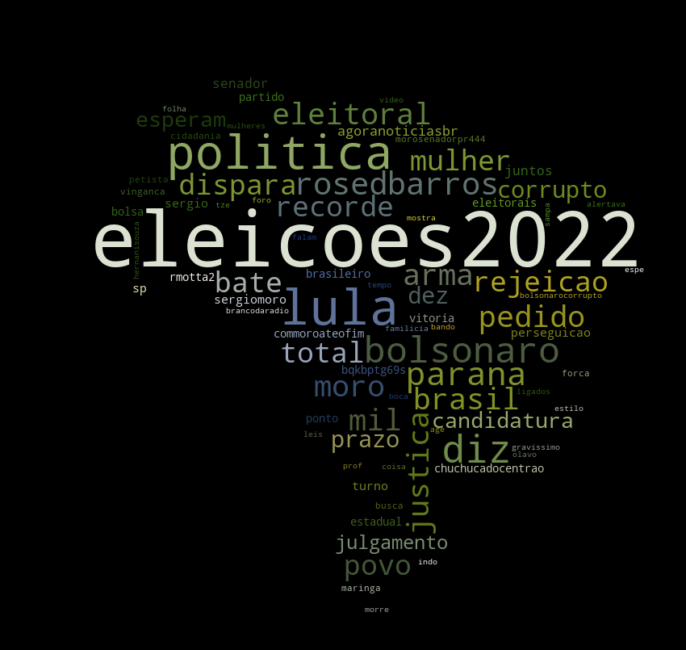
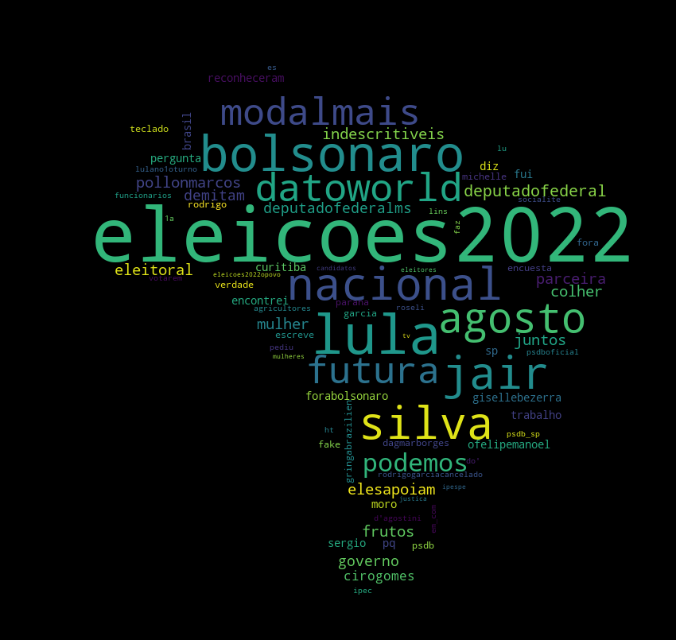

# :cloud: Nuvem de Palavras - Eleições 2022
 
:cloud: <b> Nuvem de Palavras criadas com Python acerca das Eleições Brasileiras de 2022.</b>

 <a href="#Sobre">Sobre</a> •
 <a href="#Como-Usar">Como usar</a> • 
 <a href="#Resultados">Resultados</a> • 
 <a href="#Autor-wave">Autor</a>

# Sobre: 

## O que são Nuvens de Palavras:
<b> Nuvem de Palavras, Word Cloud ou Tag Cloud são uma maneira de representar 
visualmente a relevância  de determinadas palavras em um texto. A classificação
se da pelo número de ocorrências de determinada palavra no texto, logo seu tamanho na exibição será
diretamente proporcional a sua quantidade de ocorrências.

## Objetivo do Projeto:
<b> O projeto tem como objetivo exibir de forma visual as palavras mais recorrentes em publicações no Twitter 
relacionadas as Eleições Brasileiras de 2022, utilizando a #Eleições2022 como filtro para seleção dos tweets.  

## Técnologias Usadas: 
* Python
* Pacote Anaconda (Jupyter Lab)
* Bibliotecas

# Como usar:

## Pré-Requisitos:
* Anaconda (Jupyter Lab/Notebook)
* Python 3.x
* Conta Twitter Developer
* Pandas
* Tweepy
* Numpy
* Unidecode
* Matplotlib.pyplot
* OS
* Pil
* WordCloud

## Clone o repositório para sua máquina:
* $ git clone https://github.com/RomarioHenrique/WordCloud

* Modifique o arquivo Stopwords.py para adicionar palavras que não devem ser exibidas na Nuvem.

* Altere a imagem(Brazil.png) e suas respectivas chamadas no código para mudar o formato da Nuvem.

* Utilize o Jupyter Lab ou Notebook para executar o projeto (VScode também suporta notebooks).

# Resultados
<h1 align="center">
  
</h1>

<h1 align="center">
  
</h1>

 # Autor :wave:
 
 Romario Henrique C. Rodrigues
  
